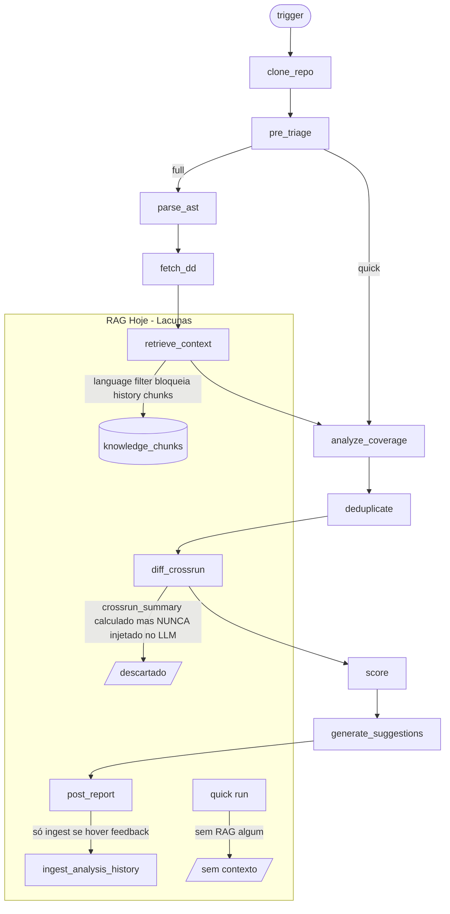
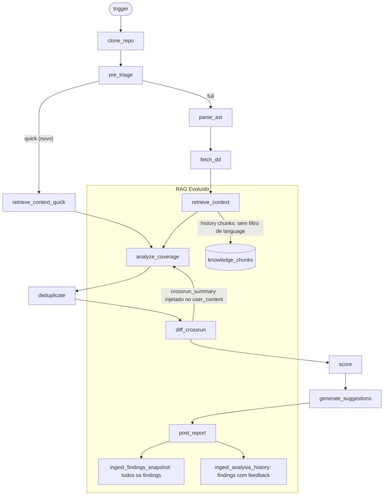
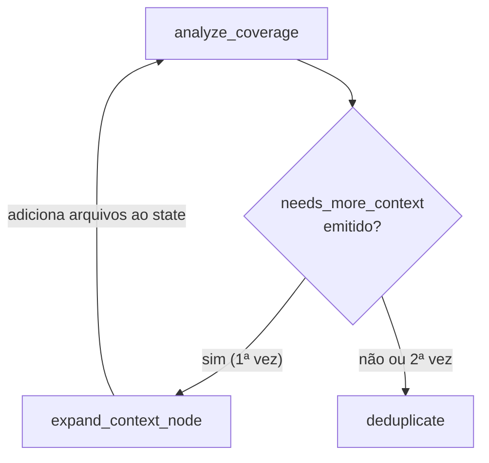
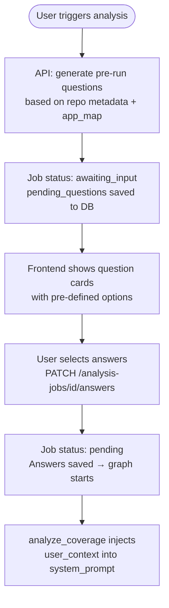

# Plano de Implementação: Evolução do RAG

## O Problema Fundamental: Análise de Partículas vs. Análise de Organismo

Hoje o LLM vê cada arquivo como uma partícula isolada. Ele sabe que `payment/processor.go` tem 300 linhas e usa OpenTelemetry — mas não sabe que:
- é chamado por 12 outros módulos
- está no domínio crítico de pagamentos
- é o caminho direto do checkout para o gateway externo
- existe um `payment/processor_test.go` cobrindo 40% das funções

O LLM precisa ver cada arquivo como um órgão dentro de um organismo — sabendo onde aquilo fica, o que impacta e qual a criticidade daquele ponto no sistema.

---

## Contexto Atual vs. Objetivo





---

## Gate G — Full Antes de Quick + Expansão Autônoma

### G.1 — Full analysis como pré-requisito para quick runs

**Problema:** Hoje `infer_analysis_type` em `analysis_service.py` (linha 39) decide `quick` quando há < 10 arquivos mudados. Um PR num repo sem nenhuma análise full anterior vai rodar cego — sem App Map, sem findings snapshot, sem topologia. O contexto histórico que faz o quick run ser preciso simplesmente não existe ainda.

**Decisão de design:** Não bloquear — auto-upgrade. Bloquear seria ruim para webhooks de PR (usuário não conseguiria feedback). Em vez disso, quando o repo não tem baseline:
- Webhook trigger: silenciosamente upgrade para `"full"` na primeira análise
- Manual trigger (frontend): mostrar banner explicativo + botão "Run Full Analysis First" antes de permitir quick

**Implementação — `analysis_service.py`:**

```python
async def _has_full_baseline(session: AsyncSession, repo_id: uuid.UUID) -> bool:
    """True if the repo has at least one completed full/repository analysis."""
    result = await session.execute(
        select(AnalysisJob.id).where(
            AnalysisJob.repo_id == repo_id,
            AnalysisJob.analysis_type.in_(["full", "repository"]),
            AnalysisJob.status == "completed",
        ).limit(1)
    )
    return result.scalar_one_or_none() is not None

# Em enqueue_analysis_from_webhook e create_manual_job:
if analysis_type == "quick":
    has_baseline = await _has_full_baseline(session, repo.id)
    if not has_baseline:
        analysis_type = "full"   # silently upgrade
        scope_type = "full_repo"
        log.info("quick_upgraded_to_full_no_baseline", repo_id=str(repo.id))
```

**Frontend:** Em `repositories/[id]/analyses/new` (ou onde o usuário inicia análise manual), fazer `GET /repos/{id}/analyses?type=full&status=completed&limit=1` antes de mostrar o seletor de tipo. Se vazio, desabilitar a opção "Quick" com tooltip: *"Run a full analysis first to build the context baseline."*

---

### G.2 — Expansão Autônoma de Contexto pelo LLM

**Conceito:** O LLM analisa um arquivo e percebe que precisa ver um arquivo correlato para dar um julgamento preciso (ex: analisa `payment/processor.go` e vê chamadas para `payment/gateway_client.go` que não está no changeset). Em vez de dar um finding incerto, ele pode sinalizar que precisa de mais contexto — e o agente autonomamente busca esses arquivos do repo já clonado e re-analisa.



**Implementação:**

1. **`schemas.py`** — adicionar ao `AgentState`:
```python
"expansion_requested": list[str] | None  # file paths solicitados pelo LLM
"expansion_count": int  # guard: max 1 expansão por run
```

2. **`analyze_coverage.py`** — permitir que o LLM emita em sua resposta JSON (já estruturada):
```json
{
  "findings": [...],
  "needs_more_context": ["payment/gateway_client.go", "billing/invoice_builder.go"]
}
```
Parser captura `needs_more_context` e salva em `state["expansion_requested"]`.

3. **Novo nó `expand_context_node`** — em `nodes/expand_context.py`:
```python
async def expand_context_node(state: AgentState) -> dict:
    requested = state.get("expansion_requested") or []
    repo_path = state.get("repo_path")
    if not requested or not repo_path:
        return {"expansion_requested": None}
    # Ler os arquivos do repo já clonado (sem novo clone)
    new_files = []
    for rel_path in requested[:5]:  # max 5 arquivos por expansão
        abs_path = Path(repo_path) / rel_path
        if abs_path.exists():
            content = abs_path.read_text(errors="replace")[:30_000]
            new_files.append({
                "path": rel_path,
                "content": content,
                "relevance_score": 2,
                "language": _detect_lang(rel_path),
                "source": "autonomous_expansion",
            })
    return {
        "changed_files": state["changed_files"] + new_files,
        "expansion_requested": None,
        "expansion_count": state.get("expansion_count", 0) + 1,
    }
```

4. **`graph.py`** — condicional após `analyze_coverage`:
```python
def _route_after_coverage(state: AgentState) -> str:
    # Expansão autônoma (só 1 vez por run para evitar loop)
    if state.get("expansion_requested") and state.get("expansion_count", 0) < 1:
        return "expand_context"
    analysis_type = state.get("request", {}).get("analysis_type", "full")
    if analysis_type == "quick":
        return "deduplicate"
    return "analyze_efficiency"

workflow.add_node("expand_context", expand_context_node)
workflow.add_conditional_edges("expand_context", lambda s: "analyze_coverage", {
    "analyze_coverage": "analyze_coverage"
})
```

---

## Fase I — Interação Pré-Análise com o Usuário

### I.1 — Perguntas com Respostas Pré-definidas

**Conceito:** Antes de rodar a análise, o sistema gera 1-3 perguntas contextuais com respostas de múltipla escolha que o usuário responde em segundos. As respostas são injetadas como contexto adicional no início da análise, calibrando o LLM sem ele precisar inferir tudo do código.

**Exemplos de perguntas geradas:**

| Trigger | Pergunta | Opções |
|---|---|---|
| Primeira análise do repo | "What is this service's criticality?" | Critical (customer-facing) / High / Standard / Internal only |
| Domínio de pagamentos detectado | "Is this service PCI-scoped?" | Yes / No / Partial |
| Framework de OTel detectado | "Is OTel configured for all environments?" | Yes / Staging only / Not yet / I don't know |
| Vários handlers detectados | "Which traffic does this service primarily handle?" | User-facing (external) / Internal service calls / Both / Batch/async only |
| repo sem Datadog/OTel | "What observability backend are you targeting?" | OpenTelemetry / Datadog / Both / Not decided |

**Arquitetura — fluxo:**



**Backend — mudanças:**

1. **`models/analysis.py`** — adicionar campos ao `AnalysisJob`:
```python
pending_questions: Mapped[list | None] = mapped_column(JSONB, nullable=True)
user_answers: Mapped[dict | None] = mapped_column(JSONB, nullable=True)
# Adicionar "awaiting_input" ao job_status_enum
status: Mapped[str] = mapped_column(
    Enum("pending", "running", "completed", "failed", "awaiting_input", name="job_status_enum"),
    ...
)
```

2. **Novo serviço `question_generator.py`** — gera perguntas baseadas no repo:
```python
def generate_pre_run_questions(repo: Repository, is_first_full: bool) -> list[Question]:
    questions = []
    # Sempre na primeira full analysis:
    if is_first_full:
        questions.append(Question(
            id="criticality",
            text="What is this service's production criticality?",
            options=["Critical (customer-facing SLA)", "High", "Standard", "Internal only"],
            multi=False,
        ))
    # Baseado em domínio detectado (app_map ou tags):
    if _has_payment_domain(repo):
        questions.append(Question(id="pci", text="Is this service PCI-scoped?",
            options=["Yes", "No", "Partial"]))
    # Baseado em linguagem/framework detectado:
    if _has_otel_but_no_backend(repo):
        questions.append(Question(id="obs_backend", text="Target observability backend?",
            options=["OpenTelemetry (OTLP)", "Datadog", "Both", "Not decided yet"]))
    return questions[:3]  # max 3 perguntas por run
```

3. **`routers/analyses.py`** — novos endpoints:
```python
# Gerar perguntas e criar job em awaiting_input:
POST /analysis-jobs  →  cria job, gera perguntas, se perguntas → status=awaiting_input + pending_questions

# Responder perguntas e resumir:
PATCH /analysis-jobs/{id}/answers
Body: { "answers": { "criticality": "Critical (customer-facing SLA)", "pci": "Yes" } }
→ salva user_answers, muda status para "pending", dispara o grafo
```

4. **`analyze_coverage.py`** — injetar `user_answers` no `context_header`:
```python
answers = state.get("request", {}).get("user_answers") or {}
if answers:
    ans_lines = "\n".join(f"  - {k}: {v}" for k, v in answers.items())
    context_header += f"\n\nUser-provided context (trust these answers):\n{ans_lines}"
```

**Frontend — `horion-frontend`:**

Nova etapa no modal de "Nova Análise": após selecionar tipo e branch, se `pending_questions` não-vazio, mostrar cards de pergunta usando design system:

```tsx
// Um card por pergunta — respostas como botões hz-btn-ghost selecionáveis
<div className="hz-fc" style={{ border: '1px solid var(--hz-rule)' }}>
  <div className="hz-fc-title">{question.text}</div>
  <div className="flex flex-wrap gap-2 mt-3">
    {question.options.map(opt => (
      <button
        key={opt}
        className={`hz-btn ${selected === opt ? 'hz-btn-primary' : 'hz-btn-ghost'}`}
        onClick={() => setAnswer(question.id, opt)}
      >{opt}</button>
    ))}
  </div>
</div>
```

O usuário pode responder em < 30 segundos. Após confirmar, o job é retomado. Para análises de webhook (PR), as perguntas aparecem no painel como um step pendente — o usuário pode responder ou ignorar (análise roda com contexto parcial após timeout de 5 minutos).

---

## Fase 0 — Consciência Topológica da Aplicação (nova — mais impacto)

Esta fase responde à pergunta: *"o LLM sabe onde cada arquivo está dentro da aplicação?"*

### 0.1 — `context_discovery` gera App Map estruturado

**Arquivo:** [`apps/agent/nodes/context_discovery.py`](apps/agent/nodes/context_discovery.py)

**Problema:** `_generate_summary` produz 2-4 frases genéricas salvas como `context_summary` (texto livre). O LLM de análise vê no máximo 1500 chars disso. Não há mapeamento de domínios, entry points do sistema, ou dependências externas identificadas.

**Solução:** Adicionar uma segunda chamada LLM no `context_discovery_node` que gera um `app_map` estruturado (JSON/texto estruturado), salvo no campo `Repository.app_map` (nova coluna JSONB). O `app_map` contém:

```python
# Estrutura do App Map gerado pelo LLM:
{
  "domains": [
    {
      "name": "payments",
      "files": ["payment/processor.go", "payment/gateway.go", "billing/invoice.go"],
      "criticality": "critical",
      "description": "Processes payment transactions via Stripe gateway"
    },
    {
      "name": "auth",
      "files": ["middleware/auth.go", "handlers/login.go"],
      "criticality": "high",
      "description": "JWT-based authentication and session management"
    }
  ],
  "external_dependencies": ["stripe API", "PostgreSQL", "Redis", "SQS"],
  "entry_points": ["handlers/", "cmd/server/main.go"],
  "architecture_type": "REST API monolith"
}
```

O prompt enviado ao LLM de contexto recebe o file tree (80 entradas) + os arquivos chave já coletados e produz esse mapeamento. Salvar como `repo.app_map = app_map_dict`.

**Injeção em `analyze_coverage.py`:** Ler `app_map` do `repo_context` e injetar no `system_prompt` como seção `## Application Architecture`:

```python
app_map = ctx.get("app_map") or {}
if app_map:
    domains = app_map.get("domains", [])
    ext_deps = ", ".join(app_map.get("external_dependencies", []))
    arch = app_map.get("architecture_type", "")
    app_map_section = f"\n\n## Application Architecture\nType: {arch}\nExternal dependencies: {ext_deps}\n"
    for d in domains[:6]:
        crit = d.get("criticality", "")
        app_map_section += f"\n- Domain [{crit}] {d['name']}: {d['description']}"
        if d.get("files"):
            app_map_section += f" (files: {', '.join(d['files'][:4])})"
```

---

### 0.2 — Classificação de domínio por arquivo em `pre_triage`

**Arquivo:** [`apps/agent/nodes/pre_triage.py`](apps/agent/nodes/pre_triage.py) e [`apps/agent/schemas.py`](apps/agent/schemas.py)

**Problema:** `ChangedFile` tem campos `language`, `relevance_score`, `content` — mas nenhum `domain` ou `role`. O LLM não tem como saber que `handlers/checkout.go` pertence ao domínio de pagamentos ou que `middleware/rate_limiter.go` é infraestrutura transversal.

**Solução:**
1. Adicionar `domain: str | None` e `file_role: str | None` ao `ChangedFile` em `schemas.py`
2. Em `pre_triage.py`, após classificar relevância, inferir `domain` e `file_role` por heurística de path + nome:

```python
# Heurística de domínio por path patterns
_DOMAIN_PATTERNS = {
    "payments": r"pay(?:ment|)?|billing|invoice|checkout|stripe|subscription",
    "auth": r"auth|login|logout|session|jwt|token|permission|role",
    "notifications": r"notif|email|sms|push|webhook",
    "data": r"db|database|repo|repository|store|query|migration",
    "infra": r"middleware|config|util|helper|common|shared|base|core",
}
_ROLE_PATTERNS = {
    "handler": r"handler|controller|route|endpoint|view|api",
    "service": r"service|usecase|business|domain",
    "repository": r"repo|store|dao|query|db",
    "worker": r"worker|job|task|celery|consumer",
    "middleware": r"middleware|interceptor|filter|guard",
    "model": r"model|schema|entity|dto|struct",
}

def _infer_domain_and_role(file_path: str, app_map: dict | None) -> tuple[str | None, str | None]:
    lower = file_path.lower()
    # Primeiro: checar no app_map se disponível
    if app_map:
        for domain in app_map.get("domains", []):
            if any(f in file_path for f in domain.get("files", [])):
                return domain["name"], None
    # Fallback: heurística de path
    domain = next((d for d, pat in _DOMAIN_PATTERNS.items() if re.search(pat, lower)), None)
    role = next((r for r, pat in _ROLE_PATTERNS.items() if re.search(pat, lower)), None)
    return domain, role
```

---

### 0.3 — Contexto por arquivo no prompt de `analyze_coverage`

**Arquivo:** [`apps/agent/nodes/analyze_coverage.py`](apps/agent/nodes/analyze_coverage.py)

**Problema:** Cada file block no `user_content` hoje começa com `# File: path/to/file.go\n{content}`. O LLM não sabe o papel daquele arquivo no sistema.

**Solução:** Antes de montar o file block, gerar um cabeçalho de contexto por arquivo usando `domain`, `file_role`, e os edges do `call_graph`:

```python
def _file_context_header(file_info: dict, call_graph: dict) -> str:
    parts = []
    if file_info.get("domain"):
        parts.append(f"Domain: {file_info['domain']}")
    if file_info.get("file_role"):
        parts.append(f"Role: {file_info['file_role']}")
    # Callers e callees do call_graph
    path = file_info["path"]
    nodes_in_file = [n for k, n in call_graph.get("nodes", {}).items() if n["file_path"] == path]
    callers = set()
    callees = set()
    for n in nodes_in_file:
        for ck in n.get("callers", []):
            caller_node = call_graph["nodes"].get(ck)
            if caller_node and caller_node["file_path"] != path:
                callers.add(caller_node["file_path"])
        for ck in n.get("callees", []):
            callee_node = call_graph["nodes"].get(ck)
            if callee_node and callee_node["file_path"] != path:
                callees.add(callee_node["file_path"])
    if callers:
        parts.append(f"Called by: {', '.join(sorted(callers)[:3])}")
    if callees:
        parts.append(f"Calls: {', '.join(sorted(callees)[:3])}")
    return (" | ".join(parts) + "\n") if parts else ""

# No file block:
ctx_header = _file_context_header(file_info, state.get("call_graph", {}))
block = f"# File: {file_info['path']}\n{ctx_header}{file_info['content']}"
```

Resultado no prompt: o LLM vê `Domain: payments | Role: handler | Called by: cmd/server/main.go | Calls: payment/gateway.go` antes do código — entendendo imediatamente o impacto daquele arquivo.

---

### 0.4 — Topologia completa do repo (passagem leve por todos os arquivos)

**Arquivo:** [`apps/agent/nodes/parse_ast.py`](apps/agent/nodes/parse_ast.py)

**Problema:** `parse_ast_node` só processa `changed_files` com `relevance_score >= 1`. Para uma análise full, se 20 arquivos mudaram, apenas esses 20 entram no call graph — mas os 200 outros arquivos do repo que **chamam** esses 20 ficam invisíveis.

**Solução:** Para análises `full` e `repository`, adicionar uma passagem leve (só extração de nomes de função, sem body analysis) por todos os arquivos do repo clonado. Isso cria um índice de nomes de função de todo o repo, permitindo que o `_populate_call_edges` identifique corretamente quem chama quem mesmo que o caller não esteja nos changed files:

```python
# Ao final de parse_ast_node, para full/repository runs:
analysis_type = state.get("request", {}).get("analysis_type", "quick")
if analysis_type in ("full", "repository") and state.get("repo_path"):
    _index_full_repo_topology(call_graph, Path(state["repo_path"]))

def _index_full_repo_topology(call_graph: CallGraph, repo: Path) -> None:
    """Light pass over all repo files to map function names to file paths."""
    skip = {".git", "__pycache__", "node_modules", "vendor", "dist", "build"}
    for p in repo.rglob("*"):
        if not p.is_file() or any(s in p.parts for s in skip):
            continue
        lang = _EXT_TO_LANG.get(p.suffix.lower())
        if not lang:
            continue
        try:
            content = p.read_text(encoding="utf-8", errors="replace")[:8000]
            rel_path = str(p.relative_to(repo))
            # Only index function names (no full node creation — lightweight)
            for m in re.finditer(r"func\s+(?:\([^)]+\)\s+)?(\w+)\s*\(", content) if lang == "go" else []:
                call_graph.full_repo_index.setdefault(m.group(1), []).append(rel_path)
        except Exception:
            pass
```

---

## Fase 1 — Quick Wins (sem nova infra)

### 1.1 — `crossrun_summary` no prompt de analyze_coverage

**Arquivo:** [`apps/agent/nodes/analyze_coverage.py`](apps/agent/nodes/analyze_coverage.py)

**Problema:** `diff_crossrun_node` retorna `crossrun_summary` para o state (linha 128 de `diff_crossrun.py`) mas `analyze_coverage_node` nunca o lê. O LLM não sabe que um finding já foi reportado 3 vezes.

**Solução:** Ler `crossrun_summary` do state e adicioná-lo ao `context_header` antes de montar `user_content`. Inserir após a linha 1002 (`context_summary[:1500]`):

```python
crossrun = state.get("crossrun_summary") or {}
if crossrun and crossrun.get("previous_job_id"):
    persisting = crossrun.get("persisting_count", 0)
    new_c = crossrun.get("new_count", 0)
    resolved = crossrun.get("resolved_count", 0)
    prev_score = crossrun.get("previous_score_global")
    delta = crossrun.get("score_delta")
    context_header += (
        f"\n\nPrevious analysis context:"
        f"\n- Previous score: {prev_score}"
        + (f" (delta: {delta:+d})" if delta is not None else "")
        + f"\n- {new_c} new issues, {persisting} persisting, {resolved} resolved"
    )
    # Inject top persisting finding titles so LLM knows what already exists
    persisting_findings = [
        f for f in state.get("findings", [])
        if f.get("crossrun_status") == "persisting"
    ][:8]
    if persisting_findings:
        titles = "\n".join(f"  • [{f['severity']}] {f['title']}" for f in persisting_findings)
        context_header += f"\n\nStill-open findings from previous run (do NOT re-introduce as new):\n{titles}"
```

> Nota: `diff_crossrun_node` roda **depois** de `analyze_coverage_node` no grafo. Para o crossrun summary existir no próximo run, ele é salvo em DB pelo `post_report_node` e carregado no `initial_state`. Verificar onde `post_report` persiste `crossrun_summary` e garantir que é salvo em `AnalysisResult.crossrun_summary`. A leitura no state durante `analyze_coverage` retorna `None` para o run atual — a injeção de findings persistentes deve usar os findings do state (já marcados como `crossrun_status = "persisting"` pelo `diff_crossrun_node` do run **anterior** que foi salvo e re-hidratado). Verificar o fluxo exato de `post_report_node` e ajustar conforme necessário.

---

### 1.2 — Tags do repo no `context_header`

**Arquivo:** [`apps/agent/nodes/analyze_coverage.py`](apps/agent/nodes/analyze_coverage.py)

**Problema:** `criticality:critical` e `team:payments` nunca chegam ao LLM. Um repo de pagamentos crítico deveria ter threshold diferente.

**Solução:** Em `graph.py` (linha 215-224), adicionar `tags` ao `repo_context`. Em `analyze_coverage.py`, logo após montar `context_header`:

```python
# graph.py — carregar tags do repo junto com repo_context
from apps.api.models.tag_system import RepoTag
repo_tags = (await session.execute(
    select(RepoTag).where(RepoTag.repo_id == repo.id)
)).scalars().all()
repo_context["tags"] = [{"key": t.key, "value": t.value} for t in repo_tags]

# analyze_coverage.py — injetar no context_header
tags = (ctx.get("tags") or [])
if tags:
    tag_str = " | ".join(f"{t['key']}:{t['value']}" for t in tags)
    context_header += f"\nRepository tags: {tag_str}"
```

---

### 1.3 — Corrigir `language=None` em `ingest_analysis_history`

**Arquivo:** [`apps/agent/tasks/ingest_analysis_history.py`](apps/agent/tasks/ingest_analysis_history.py)

**Problema:** Linha 76 e 89: `"language": None`. O `_search_index` em `retrieve_context.py` filtra por `AND language = :language` quando a linguagem do repo está definida — isso **invisibiliza todos os chunks históricos** na busca.

**Solução:** Carregar a linguagem do repo no `_run` e passar para `upsert_chunks`:

```python
# _run() — após carregar o job:
from apps.api.models.scm import Repository
repo = (await session.execute(
    select(Repository).where(Repository.id == job.repo_id)
)).scalar_one_or_none()
repo_language = (repo.language[0].lower() if repo and repo.language else None)

# No metadata dos chunks tp/fp:
"language": repo_language,

# E passar para upsert_chunks:
await upsert_chunks(..., language=repo_language, ...)
```

---

### 1.4 — Suppressed files no system prompt

**Arquivo:** [`apps/agent/nodes/analyze_coverage.py`](apps/agent/nodes/analyze_coverage.py)

**Problema:** Arquivos com `lumis-ignore` são suprimidos em `pre_triage` mas o LLM nunca sabe. Pode sugerir instrumentação em código deliberadamente excluído.

**Solução:** Adicionar ao `system_prompt` antes da seção `NEVER REPORT`:

```python
suppressed = state.get("suppressed") or []
if suppressed:
    sup_paths = "\n".join(f"  - {f['path']}" for f in suppressed[:20])
    suppressed_section = f"\n\n## Excluded Files (do NOT reference these)\n{sup_paths}"
else:
    suppressed_section = ""

system_prompt = f"""...{rag_section}{call_graph_section}{suppressed_section}{iac_constraint}..."""
```

---

### 1.5 — Fix do `asyncio.coroutine` deprecated

**Arquivo:** [`apps/agent/nodes/retrieve_context.py`](apps/agent/nodes/retrieve_context.py), linha 86

**Problema:** `asyncio.coroutine(lambda: [])()` é deprecated/removido no Python 3.11+. Quando `tenant_id` é falsy, o tenant_task não funciona corretamente.

**Solução:**
```python
# Antes (linha 84-86):
tenant_task = asyncio.create_task(
    _search_index(query_embeddings, tenant_id=tenant_id, language=_primary_language(state))
) if tenant_id else asyncio.create_task(asyncio.coroutine(lambda: [])())

# Depois:
async def _empty() -> list:
    return []

tenant_task = (
    asyncio.create_task(_search_index(query_embeddings, tenant_id=tenant_id, language=_primary_language(state)))
    if tenant_id
    else asyncio.create_task(_empty())
)
```

---

## Fase 2 — Memória Histórica Sem Feedback

### 2.1 — Nova task `ingest_findings_snapshot`

**Arquivo novo:** [`apps/agent/tasks/ingest_findings_snapshot.py`](apps/agent/tasks/ingest_findings_snapshot.py)

**Problema:** `ingest_analysis_history` só embeda findings com feedback de usuário. A maioria dos findings nunca tem feedback, logo a memória histórica é quase vazia.

**Solução:** Criar nova Celery task que roda após cada análise completa, embeda **todos** findings com severity `warning` ou `critical`, com TTL de 60 dias. Ao rodar, apaga os chunks anteriores do mesmo repo/source_type antes de inserir (substitui o snapshot anterior).

Estrutura da task:
```python
@celery_app.task(name="apps.agent.tasks.ingest_findings_snapshot")
def ingest_findings_snapshot(job_id: str) -> dict:
    ...

async def _run(job_id: str) -> dict:
    # 1. Carregar job, result, repo (com language)
    # 2. Filtrar findings: severity in ("critical", "warning"), confidence != "low"
    # 3. Apagar chunks anteriores do repo: DELETE FROM knowledge_chunks WHERE repo_id=? AND source_type='findings_snapshot'
    # 4. Build chunk text para cada finding (reusar _build_finding_chunk)
    # 5. embed_texts + upsert_chunks com source_type="findings_snapshot", language=repo_language, expires_days=60
```

**Trigger:** Em `post_report_node`, ao final (junto com `ingest_analysis_history`), disparar `ingest_findings_snapshot.delay(job_id)`.

**Seção no RAG formatter:** Em `retrieve_context.py`, adicionar mapeamento `"findings_snapshot": "Previous Findings (unconfirmed)"` em `_SOURCE_TO_SECTION` e a chave correspondente em `sections`.

---

### 2.2 — Queries de retrieval específicas por arquivo e framework

**Arquivo:** [`apps/agent/nodes/retrieve_context.py`](apps/agent/nodes/retrieve_context.py), função `_build_queries` (linha 101)

**Problema:** Queries genéricas demais. Para arquivos high-relevance, só usa `f"previous findings {repo_id} {file_path}"`.

**Solução:** Enriquecer as queries com framework, pillar e severity do histórico recente:

```python
# Substituir bloco 4 (linhas 138-144):
high_relevance = [f for f in changed_files if f.get("relevance_score", 0) >= 2][:5]
for f in high_relevance:
    file_path = f.get("path", "")
    file_lang = f.get("language", lang or "")
    framework = f.get("framework", "")
    if file_path and repo_id:
        queries.append(f"previous findings {repo_id} {file_path}")
        if framework:
            queries.append(f"{file_lang} {framework} observability missing instrumentation")
    if file_lang:
        queries.append(f"{file_lang} error handling tracing span gap")
```

---

### 2.3 — Não filtrar chunks históricos por linguagem

**Arquivo:** [`apps/agent/nodes/retrieve_context.py`](apps/agent/nodes/retrieve_context.py), função `_search_index` e `_retrieve`

**Problema:** O filtro `AND language = :language` invisibiliza chunks de `analysis_history` e `findings_snapshot` mesmo quando são do próprio repo — que é exatamente o histórico mais relevante.

**Solução:** Separar as queries em dois grupos e chamar `_search_index` com parâmetros diferentes:

```python
# Em _retrieve():
history_source_types = ("analysis_history", "findings_snapshot")

# Queries de histórico específico do repo — sem filtro de linguagem
history_queries = [q for q in queries if "previous findings" in q]
general_queries = [q for q in queries if q not in history_queries]

history_embeddings = await embed_texts(history_queries) if history_queries else []
general_embeddings = await embed_texts(general_queries) if general_queries else []

# Busca histórica: sem language filter
hist_global, hist_tenant = await asyncio.gather(
    _search_index(list(zip(history_queries, history_embeddings)), tenant_id=None, language=None),
    _search_index(list(zip(history_queries, history_embeddings)), tenant_id=tenant_id, language=None) if tenant_id else _empty(),
)
# Busca geral: com language filter (mantém comportamento atual)
gen_global, gen_tenant = await asyncio.gather(
    _search_index(list(zip(general_queries, general_embeddings)), tenant_id=None, language=lang),
    _search_index(list(zip(general_queries, general_embeddings)), tenant_id=tenant_id, language=lang) if tenant_id else _empty(),
)
all_chunks = hist_global + hist_tenant + gen_global + gen_tenant
```

---

### 2.4 — `upsert_chunks` substituir ao invés de ignorar duplicatas

**Arquivo:** [`apps/agent/tasks/rag_shared.py`](apps/agent/tasks/rag_shared.py), linha 134

**Problema:** `ON CONFLICT DO NOTHING` faz com que re-ingestão de chunks não atualize o `expires_at`. Chunks antigos ficam com expiração errada.

**Solução:** Adicionar função `upsert_chunks_replace` ou modificar a existente para usar `ON CONFLICT (id) DO UPDATE SET expires_at = EXCLUDED.expires_at, metadata = EXCLUDED.metadata`. Alternativamente, para `findings_snapshot`, a task já apaga os chunks anteriores do repo antes de inserir (via `DELETE WHERE repo_id = ? AND source_type = 'findings_snapshot'`) — adicionar helper `delete_repo_source_chunks(repo_id, source_type)` em `rag_shared.py`.

---

## Fase 3 — Quick Runs com Contexto

### 3.1 — RAG parcial para quick runs

**Arquivos:** [`apps/agent/graph.py`](apps/agent/graph.py) e [`apps/agent/nodes/retrieve_context.py`](apps/agent/nodes/retrieve_context.py)

**Problema:** Quick runs (PRs) pulam completamente o `retrieve_context` (linha 59 de `graph.py`: `return "analyze_coverage"` direto). São os runs mais frequentes, mas operam sem nenhum contexto histórico.

**Solução:** Modificar o grafo para que quick runs também passem por `retrieve_context`, mas com um modo `quick=True` que limita a 3-4 queries específicas para os arquivos modificados (sem queries genéricas de best practices):

```python
# graph.py — linha 58-60:
if analysis_type == "quick":
    return "retrieve_context"  # passar por RAG também

# retrieve_context.py — _build_queries():
analysis_type = state.get("request", {}).get("analysis_type")
if analysis_type == "quick":
    # Apenas queries de histórico para os arquivos modificados
    for f in changed_files[:5]:
        if f.get("path") and repo_id:
            queries.append(f"previous findings {repo_id} {f['path']}")
    return queries  # sem queries genéricas
```

---

### 3.2 — Boost temporal no re-ranker

**Arquivo:** [`apps/agent/nodes/retrieve_context.py`](apps/agent/nodes/retrieve_context.py), função `_rerank` (linha 227)

**Problema:** Chunks de 89 dias atrás e de ontem têm o mesmo peso. Histórico recente deveria ser preferido.

**Solução:**

```python
from datetime import datetime
from dateutil.parser import parse as _parse_dt

def _rerank(chunks: list[dict]) -> list[dict]:
    def _score(chunk: dict) -> float:
        sim = chunk["similarity"]
        if chunk["source_type"] in ("tenant_standards", "analysis_history", "cross_repo_pattern", "findings_snapshot"):
            sim += 0.05
        # Boost temporal: até +0.03 para chunks com menos de 30 dias
        confirmed_at = (chunk.get("metadata") or {}).get("confirmed_at")
        if confirmed_at:
            try:
                days_old = (datetime.utcnow() - _parse_dt(confirmed_at).replace(tzinfo=None)).days
                sim += max(0.0, 0.03 * (1 - days_old / 30))
            except Exception:
                pass
        return sim
    return sorted(chunks, key=_score, reverse=True)
```

Nota: `dateutil` já é dependência transitiva do projeto (via `celery`/`kombu`). Verificar antes de adicionar import.

---

## Arquivos Modificados — Resumo

| Arquivo | Fase | Tipo de mudança |
|---|---|---|
| `apps/api/services/analysis_service.py` | G.1 | Gate full-before-quick + `_has_full_baseline()` |
| `apps/api/models/analysis.py` | G.2, I.1 | `pending_questions`, `user_answers`, status `awaiting_input` |
| `apps/api/routers/analyses.py` | I.1 | `PATCH /analysis-jobs/{id}/answers` |
| `apps/api/services/question_generator.py` | I.1 | **Novo arquivo** — gerador de perguntas contextuais |
| `apps/agent/schemas.py` | G.2, 0.2 | `expansion_requested`, `expansion_count`, `domain`, `file_role` |
| `apps/agent/nodes/expand_context.py` | G.2 | **Novo nó** — busca arquivos adicionais do repo clonado |
| `apps/agent/graph.py` | G.2, 1.2, 3.1 | Nó `expand_context`, condicional expansão, tags + app_map, quick → retrieve_context |
| `apps/agent/nodes/context_discovery.py` | 0.1 | Gerar App Map estruturado, salvar em `repo.app_map` |
| `apps/agent/nodes/pre_triage.py` | 0.2 | Inferir `domain` e `file_role` por arquivo |
| `apps/agent/nodes/analyze_coverage.py` | G.2, 0.3, I.1, 1.1, 1.2, 1.4 | Cabeçalho por arquivo + expansão + interação + crossrun + tags + suppressed |
| `apps/agent/nodes/parse_ast.py` | 0.4 | Passagem leve por repo inteiro para topologia completa |
| `apps/agent/nodes/retrieve_context.py` | 1.5, 2.2, 2.3, 3.1, 3.2 | Fix coroutine, split queries, boost temporal, quick RAG |
| `apps/agent/tasks/ingest_analysis_history.py` | 1.3 | Passar `language` correto |
| `apps/agent/tasks/rag_shared.py` | 2.4 | Adicionar `delete_repo_source_chunks` |
| `apps/agent/tasks/ingest_findings_snapshot.py` | 2.1 | **Novo arquivo** — task Celery |
| `apps/agent/nodes/post_report.py` | 2.1 | Disparar `ingest_findings_snapshot.delay` |
| `apps/api/models/scm.py` | 0.1 | Adicionar campo `app_map JSONB` ao model `Repository` |
| `apps/api/migrations/` | 0.1, I.1 | Migrations: `app_map` em repositories + `awaiting_input` enum + questions fields |
| `horion-frontend` — modal de análise | I.1, G.1 | Cards de perguntas pré-definidas + gate UI full-before-quick |
