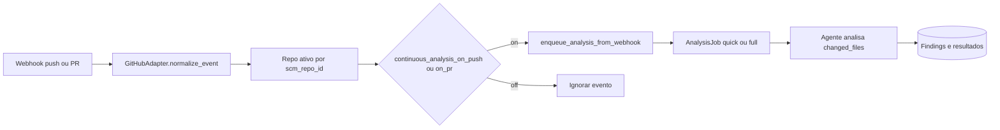

# Plano: UX ao adicionar repo, contexto colapsável, avaliação contínua por repositório

## 1. Adicionar repositório — sem ir para a página de análise

**Situação:** Em [`horion-frontend/src/app/(dashboard)/repositories/page.tsx`](horion-frontend/src/app/(dashboard)/repositories/page.tsx), o `onSuccess` de `activateMutation` chama `router.push(\`/analyses/${job.id}\`)` após `analysesApi.trigger(..., 'context')`.

**Alteração:** Remover o `router.push`. Manter:
- `setContextDiscoveryRepoId` / `setContextDiscoveryJobId` e o toast já existentes;
- o indicador visual **"analyzing context…"** junto ao nome do repositório (já implementado quando `contextDiscoveryRepoId === repo.id`).

Opcional (copy): ajustar o texto do toast para deixar claro que o utilizador pode continuar na lista (ex.: contexto a ser analisado em segundo plano).

---

## 2. Contexto — dropdown / só abre quando o utilizador quiser

**Lista (`repositories/page.tsx`):** Hoje o resumo (`RepoContextSummary`) aparece sempre que existe `context_summary`, e o painel completo ao clicar em "Edit context". **Proposta:** envolver o bloco do resumo + eventual conteúdo relacionado num `
` / botão com `aria-expanded` (padrão Horion: `--hz-*`, sem Tailwind de cor), com sumário do tipo **"Repository context"** / **"Show context"**, fechado por defeito (ou aberto só se não houver resumo e o utilizador tiver aberto antes — o mais simples é **fechado por defeito**).

**Detalhe do repositório:** Em [`horion-frontend/src/app/(dashboard)/repositories/[repoId]/RepoDetailClient.tsx`](horion-frontend/src/app/(dashboard)/repositories/[repoId]/RepoDetailClient.tsx), o componente `ContextSection` é sempre expandido. **Proposta:** mesmo padrão — cabeçalho clicável que expande o `<dl>` + recomendação de instrumentação (`InstrumentationRecommendationCard` pode ficar dentro do painel expandido para não ocupar espaço quando fechado).

Ficheiros a tocar: essencialmente os dois acima; reutilizar classes existentes (`.hz-label`, bordas `var(--hz-rule)`).

---

## 3. Avaliação contínua (push / PR) — configuração por repositório

### Comportamento desejado (alinhado ao código atual)

- Em [`lumis/apps/api/services/analysis_service.py`](lumis/apps/api/services/analysis_service.py), `enqueue_analysis_from_webhook` já cria jobs com `changed_files`, `analysis_type` quick/full conforme o número de ficheiros, e `trigger` `pr` ou `push` (ver [`AnalysisRequest`](lumis/apps/api/services/analysis_service.py) e enum em [`apps/api/models/analysis.py`](lumis/apps/api/models/analysis.py)).
- **Findings** já ficam persistidos como nas análises manuais (resultado + `findings` em BD). Não é necessário um novo armazenamento só para "sugestão salva" — o fluxo de PR/push já gera análise com findings; Fix PR continua a depender das regras atuais (`has_recommendations_for_fix_pr`, tipo de análise, etc.).

**Lacuna:** não existe flag por repositório: **todos** os repos ativos que correspondem ao webhook são analisados.

### Backend (Lumis)

1. **Migration** em Postgres: adicionar à tabela `repositories` duas colunas boolean NOT NULL, por exemplo:
   - `continuous_analysis_on_push` (default a definir — ver nota abaixo)
   - `continuous_analysis_on_pr` (idem)

   Atualizar [`apps/api/models/scm.py`](lumis/apps/api/models/scm.py) (`Repository`).

2. **Gating** em `enqueue_analysis_from_webhook` (logo após resolver `repo`):
   - se `request.trigger == "push"` e não `repo.continuous_analysis_on_push` → `log.info` + `return None`
   - se `request.trigger == "pr"` e não `repo.continuous_analysis_on_pr` → idem

3. **API:** expor os campos em [`RepoResponse`](lumis/apps/api/routers/repositories.py) e permitir atualização, por exemplo:
   - `PATCH /api/v1/repositories/{repo_id}/settings` com body `{ continuous_analysis_on_push?: bool, continuous_analysis_on_pr?: bool }`  
   (evita misturar com `PATCH .../context` que é só contexto.)

4. **Default na migration:** decisão de produto:
   - **Conservar comportamento atual para instalações existentes:** `DEFAULT true` para ambos (webhooks continuam a disparar até o utilizador desligar).
   - **Opt-in explícito:** `DEFAULT false` (comportamento de webhook muda — utilizadores têm de ativar por repo).

   Recomendação: documentar no PR e alinhar contigo; para MVP interno, `false` + copy na UI explica o que ativar.

5. **GitLab / Bitbucket:** o handler GitHub já processa `push` e `pull_request`. [`webhooks.py` GitLab](lumis/apps/api/routers/webhooks.py) está em TODO — o plano de UI/API aplica-se igual quando o adaptador GitLab existir; não bloqueia a entrega GitHub.

### Frontend (Horion)

1. Estender [`Repository`](horion-frontend/src/lib/api.ts) e `reposApi` com `patchSettings` (ou nome consistente) para o novo endpoint.

2. **UI por repositório:** secção clara (ex.: na página [`RepoDetailClient.tsx`](horion-frontend/src/app/(dashboard)/repositories/[repoId]/RepoDetailClient.tsx) e/ou linha da lista em `repositories/page.tsx`) com:
   - dois toggles: **Analyze on push** / **Analyze on pull request** (ou labels equivalentes alinhados à marca);
   - texto curto: análise nos ficheiros alterados; findings ficam na lista de análises (e cruzamento com runs anteriores quando aplicável).

3. Invalidar `['repositories']` / `['repository', repoId]` após guardar.

---

## 4. Diagrama do fluxo (avaliação contínua)

---

## Ordem sugerida de implementação

1. Migration + modelo + `RepoResponse` + `PATCH settings` + gate em `enqueue_analysis_from_webhook`.
2. Frontend: tipos, API, toggles no detalhe (e opcionalmente na lista).
3. Remover `router.push` no add repo + ajustar toast se necessário.
4. Contexto colapsável em `RepoDetailClient` e na lista.

## Testes manuais rápidos

- Adicionar repo: não navega para `/analyses/...`; aparece "analyzing context…" e toast.
- Com flags off: webhook simulado ou evento real não cria job (ver logs).
- Com flags on: job criado com `changed_files` e findings após conclusão.
