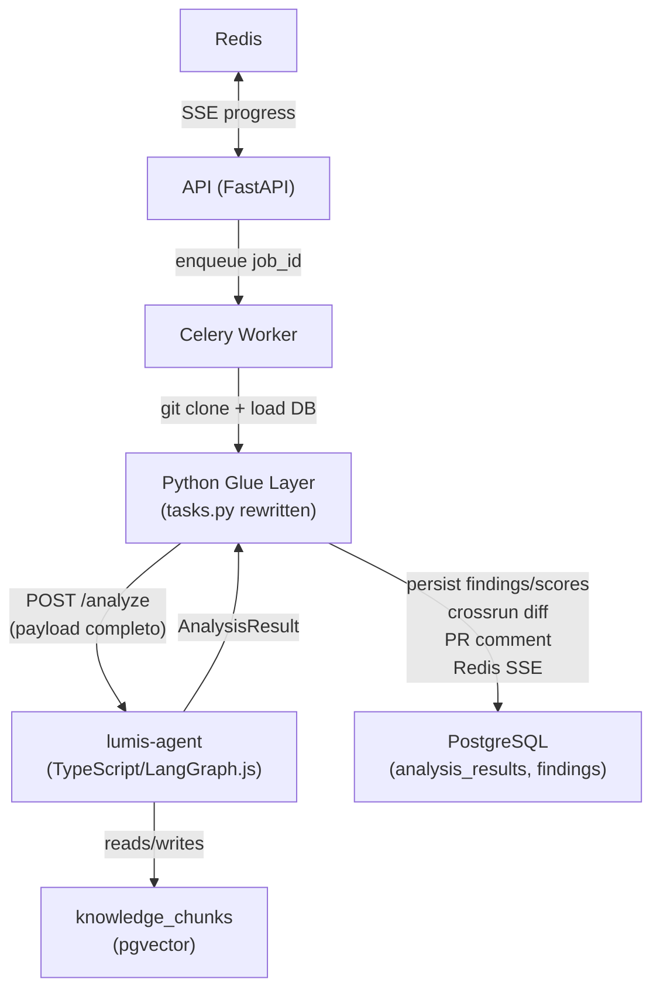

# Integração do Novo Agente TypeScript

## Contexto e Arquitetura Alvo



## 1. Conflitos críticos a resolver

### 1.1 `pillar` enum — valores incompatíveis

| Estado atual (DB) | Novo agente TS retorna |
|---|---|
| `metrics` `logs` `traces` `iac` `pipeline` | `coverage` `metrics` `efficiency` `compliance` `security` |

**Abordagem:** Adicionar os 3 novos valores (`coverage`, `efficiency`, `security`) ao `pillar_enum` sem remover os existentes. Jobs antigos continuam válidos.

### 1.2 `dimension` — enum estrito vs. strings livres

O enum atual tem apenas 5 valores (`cost|snr|pipeline|compliance|coverage`). O TS agent retorna ~15 dimensões livres (`injection`, `distributed_tracing`, `query_optimization`, etc.). A coluna `dimension` precisa ser migrada de `Enum` para `TEXT`.

### 1.3 Scores — colunas novas vs. antigas

| Colunas atuais em `analysis_results` | Novos scores do TS agent |
|---|---|
| `score_metrics` `score_logs` `score_traces` `score_cost` `score_snr` `score_pipeline` `score_compliance` | `coverage` `metrics` `efficiency` `compliance` `security` |

**Abordagem:** Adicionar 3 novas colunas (`score_coverage`, `score_efficiency`, `score_security`) e manter as antigas — jobs antigos preenchem as antigas, jobs novos preenchem as novas. Frontend detecta qual conjunto está preenchido.

### 1.4 Interface Python → TypeScript

O worker Python não pode importar TypeScript. O `lumis-agent` precisa expor um **endpoint HTTP mínimo** (`POST /analyze`) que o worker chama com `httpx`.

### 1.5 Progress events (SSE)

O TS agent é síncrono (não publica Redis). O Glue layer do worker deve publicar eventos de milestone no Redis.

### 1.6 Suggestions separadas → fundidas nos findings

O TS agent retorna `suggestions[]` separado dos `findings[]`. O Glue layer faz a fusão por `findingTitle` antes de persistir, populando `code_before`/`code_after`/`suggestion` nos findings.

### 1.7 Cross-run diff

O TS agent não faz crossrun. O Glue layer executa a lógica atual de `diff_crossrun_node` (já implementada em `apps/agent/nodes/diff_crossrun.py`) como função pura, sem LangGraph.

---

## 2. Alterações de Banco (Migration SQL)

Um único script de migração idempotente (`ALTER ... ADD COLUMN IF NOT EXISTS`, `CREATE INDEX IF NOT EXISTS`). Todos os `ALTER TYPE ... ADD VALUE` executados fora de transação (limitação do PostgreSQL).

**Arquivo:** `infra/migrations/003_multi_agent_support.sql`

```sql
-- pillar_enum: novos valores
ALTER TYPE pillar_enum ADD VALUE IF NOT EXISTS 'coverage';
ALTER TYPE pillar_enum ADD VALUE IF NOT EXISTS 'efficiency';
ALTER TYPE pillar_enum ADD VALUE IF NOT EXISTS 'security';

-- dimension: de enum para TEXT
ALTER TABLE findings ALTER COLUMN dimension TYPE TEXT;

-- analysis_results: novos scores + colunas de rastreamento
ALTER TABLE analysis_results
  ADD COLUMN IF NOT EXISTS score_coverage INTEGER,
  ADD COLUMN IF NOT EXISTS score_efficiency INTEGER,
  ADD COLUMN IF NOT EXISTS score_security INTEGER,
  ADD COLUMN IF NOT EXISTS agent_breakdown JSONB DEFAULT '{}',
  ADD COLUMN IF NOT EXISTS prompt_modes_used TEXT[] DEFAULT '{}',
  ADD COLUMN IF NOT EXISTS total_passes INTEGER DEFAULT 1,
  ADD COLUMN IF NOT EXISTS llm_model TEXT,
  ADD COLUMN IF NOT EXISTS active_agents TEXT[] DEFAULT '{}',
  ADD COLUMN IF NOT EXISTS detected_languages TEXT[] DEFAULT '{}';

-- findings: rastreabilidade por agente
ALTER TABLE findings
  ADD COLUMN IF NOT EXISTS source_agent TEXT,
  ADD COLUMN IF NOT EXISTS prompt_mode TEXT,
  ADD COLUMN IF NOT EXISTS verified BOOLEAN DEFAULT false,
  ADD COLUMN IF NOT EXISTS confidence FLOAT,
  ADD COLUMN IF NOT EXISTS reasoning_excerpt TEXT;

-- knowledge_chunks: qualidade e seed idempotente
ALTER TABLE knowledge_chunks
  ADD COLUMN IF NOT EXISTS confidence_score FLOAT DEFAULT 1.0,
  ADD COLUMN IF NOT EXISTS model_validated_by TEXT,
  ADD COLUMN IF NOT EXISTS source_version TEXT;

-- repositories: config por repo
ALTER TABLE repositories
  ADD COLUMN IF NOT EXISTS analysis_config JSONB DEFAULT '{}';

-- finding_feedback: rastreamento do pipeline de aprendizado
ALTER TABLE finding_feedback
  ADD COLUMN IF NOT EXISTS source_agent TEXT,
  ADD COLUMN IF NOT EXISTS processed BOOLEAN DEFAULT false,
  ADD COLUMN IF NOT EXISTS processed_at TIMESTAMPTZ;
```

**Índices** (conforme TS doc §14.9): idx_findings_source_agent, idx_findings_verified, idx_findings_confidence, idx_kc_confidence, idx_kc_source_version, uq_kc_seed_section (parcial), uq_kc_tenant_section (parcial), idx_kc_tenant/source/lang/pillar/repo/expires, idx_knowledge_chunks_embedding (HNSW), idx_ff_processed, idx_ff_source_agent.

---

## 3. SQLAlchemy Models (`apps/api/models/analysis.py`)

- `Finding.pillar` — ampliar enum para incluir `coverage`, `efficiency`, `security`
- `Finding.dimension` — mudar de `Enum(...)` para `Text` (sem restrição)
- `Finding` — adicionar: `source_agent`, `prompt_mode`, `verified`, `confidence`, `reasoning_excerpt`
- `AnalysisResult` — adicionar: `score_coverage`, `score_efficiency`, `score_security`, `agent_breakdown`, `prompt_modes_used`, `total_passes`, `llm_model`, `active_agents`, `detected_languages`

`apps/api/models/knowledge.py`:
- `KnowledgeChunk` — adicionar: `confidence_score`, `model_validated_by`, `source_version`

`apps/api/models/scm.py`:
- `Repository` — adicionar: `analysis_config` (JSONB)

`apps/api/models/analysis.py`:
- `FindingFeedback` — adicionar: `source_agent`, `processed`, `processed_at`

---

## 4. API Layer (`apps/api/routers/analyses.py`)

`AnalysisResultPayload` — expor novos campos:
```python
score_coverage: int | None = None
score_efficiency: int | None = None
score_security: int | None = None
agent_breakdown: dict = {}
detected_languages: list[str] = []
```

`_job_to_response()` — mapear os novos campos do `AnalysisResult` para o payload.

---

## 5. Worker Glue Layer (`apps/worker/tasks.py`)

O task `run_analysis` deixa de chamar `run_analysis_graph(job_id)` e passa a:

1. Carregar job + repo + scm_connection do DB
2. Clonar repo (`git clone --depth 1`) em `/tmp/lumis-<job_id>`
3. Publicar evento Redis `cloning` (pct=5)
4. Carregar `previousFindings` do último job completado para o repo
5. Carregar `feedbackHistory` de `finding_feedback WHERE processed = false`
6. Construir o payload `AnalysisRequest` do TS
7. Publicar evento Redis `analyzing` (pct=20)
8. `POST http://<TS_AGENT_URL>/analyze` via `httpx` (timeout longo ~10min)
9. Receber `AnalysisResult`
10. Publicar evento Redis `scoring` (pct=75)
11. Mesclar `suggestions[]` com `findings[]` por `findingTitle`
12. Executar `diff_crossrun` (função pura, reutilizada de `apps/agent/nodes/diff_crossrun.py`)
13. Persistir em `analysis_results` + `findings` (reutilizar lógica de `apps/agent/nodes/post_report.py`)
14. Publicar evento Redis `posting` (pct=90)
15. Postar comentário no PR se `pr_number` present
16. Marcar feedback como `processed = true`
17. Limpar `/tmp/lumis-<job_id>`
18. Publicar evento Redis `done` (pct=100)

**Nova env var necessária:**
```env
TS_AGENT_URL=http://lumis-agent:3000
```

---

## 6. TS Agent — Endpoint HTTP mínimo

O `lumis-agent` precisa adicionar um wrapper Express mínimo (`src/server.ts`):

```typescript
import express from 'express';
import { runAnalysis } from './index';

const app = express();
app.use(express.json({ limit: '50mb' }));

app.post('/analyze', async (req, res) => {
  try {
    const result = await runAnalysis(req.body);
    res.json(result);
  } catch (err) {
    res.status(500).json({ error: String(err) });
  }
});

app.listen(3000);
```

---

## 7. Frontend (`apps/web/src/app/(dashboard)/analyses/[id]/page.tsx`)

O score display hardcoded usa `score_metrics|score_logs|score_traces`. Precisa de lógica dual:

```typescript
// Detectar qual conjunto de scores usar (antigo vs. novo agente)
const isNewAgent = result.score_coverage != null || result.score_efficiency != null;
const scorePillars = isNewAgent
  ? [
      { label: 'Global',      score: result.score_global,      pillar: undefined },
      { label: 'Coverage',    score: result.score_coverage,    pillar: 'coverage' },
      { label: 'Efficiency',  score: result.score_efficiency,  pillar: 'efficiency' },
      { label: 'Security',    score: result.score_security,    pillar: 'security' },
      { label: 'Compliance',  score: result.score_compliance,  pillar: 'compliance' },
    ]
  : [
      { label: 'Global',   score: result.score_global,   pillar: undefined },
      { label: 'Metrics',  score: result.score_metrics,  pillar: 'metrics' },
      { label: 'Logs',     score: result.score_logs,     pillar: 'logs' },
      { label: 'Traces',   score: result.score_traces,   pillar: 'traces' },
    ];
```

O tipo `AnalysisResult` (TypeScript) em `page.tsx` precisa receber os novos campos.

---

## 8. Arquivos afetados

| Arquivo | Mudança |
|---|---|
| `infra/migrations/003_multi_agent_support.sql` | NOVO — migration completa |
| `apps/api/models/analysis.py` | Novos campos em `Finding`, `AnalysisResult`, `FindingFeedback` |
| `apps/api/models/knowledge.py` | Novos campos em `KnowledgeChunk` |
| `apps/api/models/scm.py` | `analysis_config` em `Repository` |
| `apps/api/routers/analyses.py` | `AnalysisResultPayload` + `_job_to_response` |
| `apps/worker/tasks.py` | `run_analysis` task reescrita — chama TS via HTTP |
| `apps/web/src/app/(dashboard)/analyses/[id]/page.tsx` | Score display dual-mode |
| `lumis-agent/src/server.ts` | NOVO — wrapper HTTP Express |
| `.env.local` / configs | Nova var `TS_AGENT_URL` |

---

## 9. Rollback

A migration é totalmente reversível com `DROP COLUMN IF EXISTS` e `DROP INDEX IF EXISTS` (conforme §14.10 do doc). O worker pode voltar a chamar `run_analysis_graph(job_id)` enquanto o TS agent não estiver deployado.