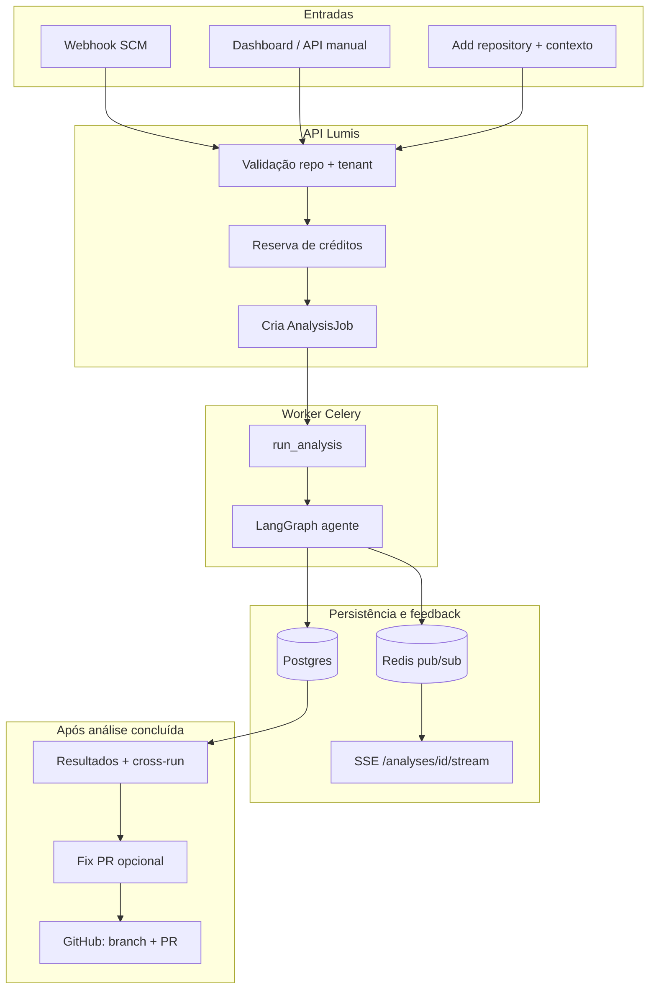

# Fluxo: análise de repositório e Fix PR (Lumis)

Este documento descreve, em alto nível, como a plataforma dispara uma **análise de observabilidade** sobre um repositório e como o **Fix PR** (pull request com correções sugeridas) se encaixa no ciclo.

---

## Visão geral

---

## 1. Como uma análise é criada

### 1.1 Webhook (GitHub / GitLab / fluxo equivalente)

1. O SCM envia evento (ex.: push, pull request) para o endpoint de webhook da API.
2. O adaptador normaliza o payload em um **pedido de análise** (repositório, commit, branch, lista de arquivos alterados, número do PR quando aplicável).
3. A API localiza o **repositório** já ligado ao tenant (`scm_repo_id`, ativo).
4. **Idempotência**: se já existir job para o mesmo `commit_sha` + `pr_number` sem falha, o evento pode ser ignorado.
5. **Billing**: reserva de créditos conforme o tipo inferido (`quick` vs `full` pelo número de arquivos alterados).
6. Cria-se um registro **`AnalysisJob`** (`pending`, trigger `pr` ou `push`, etc.).
7. Enfileira-se a task Celery **`run_analysis(job_id, reservation_token)`**.

### 1.2 Manual (dashboard ou `POST /api/v1/analyses`)

1. O utilizador escolhe repositório, branch/ref e tipo (`quick`, `full`, `repository`, ou `context` para descoberta de contexto).
2. Validação de tenant + repositório ativo.
3. **Context** não consome créditos; os outros tipos passam pela **reserva de créditos**.
4. Cria-se o **`AnalysisJob`** com `trigger=manual` e os ficheiros opcionais em `changed_files`.
5. **`run_analysis.delay(...)`** é chamado da mesma forma.

### 1.3 Add repository + análise de contexto

Ao ativar um repositório novo, a API pode disparar uma análise do tipo **`context`** (gratuita) para preencher resumo/estrutura do repo. O fluxo de worker é o mesmo (`run_analysis`), mas o grafo do agente segue o ramo **context discovery** (mais curto).

Análises **`full`** / **`repository`** podem ainda **disparar em background** um refresh de contexto se o resumo estiver desatualizado (regra de serviço).

---

## 2. Execução no worker: `run_analysis`

1. O job passa a **`running`** na base de dados.
2. Chama-se **`run_analysis_graph(job_id)`** (LangGraph em `apps/agent/graph.py`).
3. Em caso de **sucesso**: job **`completed`**, consumo de créditos reservados.
4. Em caso de **erro**: job **`failed`**, libertação de créditos, e publicação de evento terminal no Redis (para o cliente SSE não ficar à espera indefinidamente).

---

## 3. Pipeline do agente (LangGraph) — resumo

O grafo varia conforme o **tipo de análise** (`quick`, `full`, `repository`, `context`), mas a ideia geral é:

1. **Clone** do repositório (e/ou preparação do scope de ficheiros).
2. **Pré-triagem** / classificação de ficheiros relevantes.
3. Caminhos possíveis: **IaC**, **AST**, integração **Datadog**, **RAG** (retrieve de contexto da knowledge base), análise de **cobertura** e **eficiência**, **deduplicação** de findings.
4. **`diff_crossrun`**: compara com a **última análise concluída** do mesmo repositório (fingerprints), marca **novo / persistindo / resolvido** e preenche **`crossrun_summary`** (incluindo delta de score quando aplicável).
5. **Pontuação** e **sugestões** (ex.: código).
6. **`post_report`**: grava **`AnalysisResult`** + linhas **`Finding`**, atualiza o job, comenta **no PR** (GitHub) se a análise for de PR, e publica progresso **`done`**.

Progresso intermédio é enviado para **Redis** (`publish_progress`) e pode ser seguido em tempo real via **SSE** `GET /api/v1/analyses/{job_id}/stream` (com token Bearer).

---

## 4. Resultado na API e na UI

- **`GET /api/v1/analyses/{id}`** devolve o job, scores, findings (com `crossrun_status` quando existir comparação) e **`crossrun_summary`** (resolvidos, novos, ainda abertos, `score_delta` vs análise anterior).
- A lista de análises pode mostrar tendência de score (**vs prev**).
- O utilizador vê **percepção de melhoria** entre corridas (findings que deixaram de aparecer, score que subiu), não só “novos” avisos.

---

## 5. Fluxo do Fix PR (correções via pull request)

O Fix PR **não** corre dentro do mesmo grafo da análise principal; é um **segundo passo opcional** depois de existir uma análise **concluída** com findings acionáveis.

### 5.1 Elegibilidade

- Pelo menos um finding com **severidade** critical ou warning, **pillar** metrics/logs/traces e **caminho de ficheiro** (regras alinhadas entre API e worker em `fix_pr_service`).

### 5.2 Disparo

1. O utilizador clica em **Create Fix PR** na UI (ou chama `POST /api/v1/analyses/{job_id}/fix-pr`).
2. A API valida o job (tenant, estado `completed`, já não ter PR, haver recomendações elegíveis).
3. Marca **`fix_pr_enqueued_at`** e enfileira **`create_fix_pr.delay(job_id)`**.

### 5.3 Task `create_fix_pr`

1. Lê findings e repositório (token GitHub App / SCM).
2. Gera alterações de código (ex.: modelo Claude) e filtra para **hunks relacionados com observabilidade**.
3. Cria **branch**, **commit(s)** e abre **Pull Request** no GitHub (fluxo atual centrado em GitHub).
4. Grava **`fix_pr_url`** no `AnalysisJob` e limpa o estado de “em geração”.

### 5.4 Relação com o ciclo de melhoria

- Depois de **merge** do PR, o utilizador deve **rodar uma nova análise** (manual ou por webhook no branch principal).
- A próxima análise usa **`diff_crossrun`** para mostrar **findings resolvidos** e **delta de score**, fechando o loop “sugerir → aplicar → medir”.

---

## 6. Onde olhar no código (referência rápida)

| Etapa | Local principal |
|--------|------------------|
| Webhook → fila | `apps/api/routers/webhooks.py`, `apps/api/services/analysis_service.py` |
| API manual | `apps/api/routers/analyses.py`, `enqueue_manual_analysis` |
| Worker análise | `apps/worker/tasks.py` (`run_analysis`) |
| Grafo agente | `apps/agent/graph.py`, nós em `apps/agent/nodes/` |
| Progresso Redis / SSE | `apps/agent/nodes/base.py`, `apps/api/routers/analyses.py` (`/stream`) |
| Cross-run / resolvidos | `apps/agent/nodes/diff_crossrun.py`, `apps/agent/nodes/deduplicate.py` |
| Persistência resultados | `apps/agent/nodes/post_report.py`, `apps/api/models/analysis.py` |
| Fix PR | `apps/api/routers/analyses.py` (`/fix-pr`), `apps/api/services/fix_pr_service.py`, `apps/worker/tasks.py` (`create_fix_pr`) |

---

## 7. Glossário rápido

| Termo | Significado |
|--------|-------------|
| **AnalysisJob** | Trabalho único de análise (pending → running → completed/failed). |
| **AnalysisResult** | Scores, findings (JSONB), `crossrun_summary`, ligação ao job. |
| **Finding** | Problema ou recomendação pontuada (linha ORM + snapshot JSONB). |
| **Fix PR** | PR automático com patches sugeridos a partir dos findings elegíveis. |
| **Cross-run** | Comparação com a execução anterior no mesmo repositório. |
