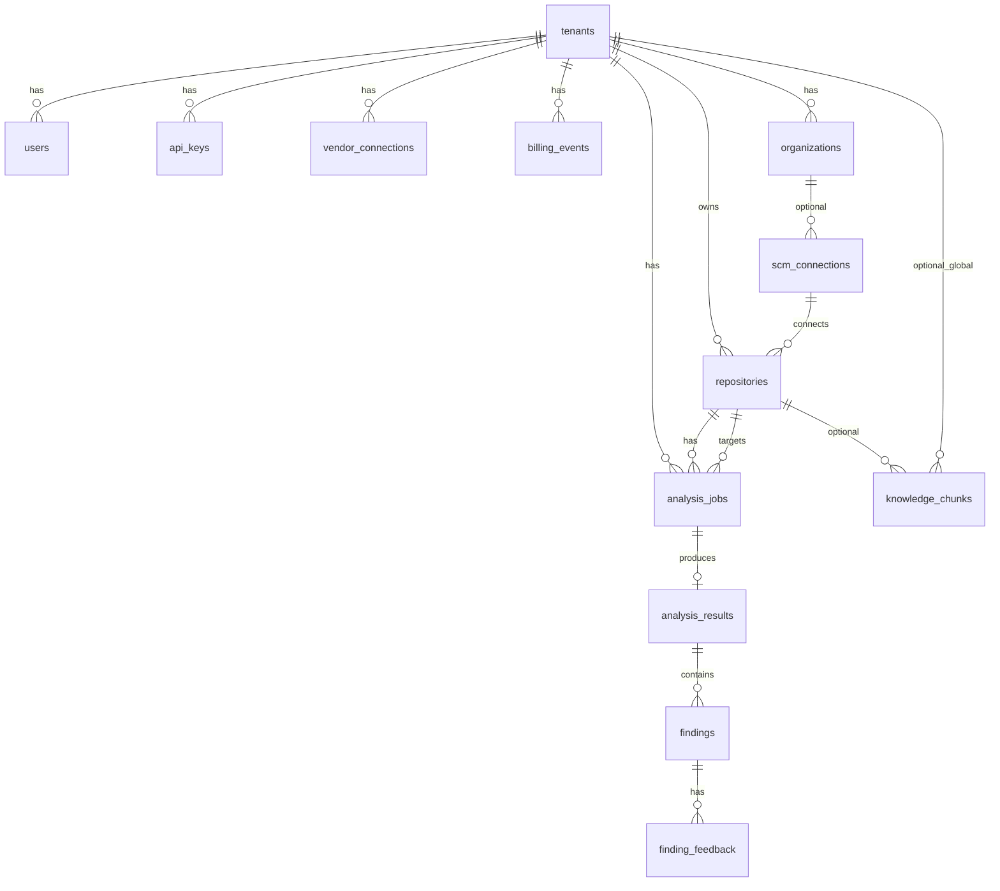

# Schema do banco de dados, agente e fluxo de análise

Documento de referência do modelo de dados PostgreSQL (SQLAlchemy), do **agente LangGraph** e do **passo a passo** de uma análise de observabilidade no Lumis.

---

## 1. Visão geral da arquitetura

| Camada | Papel |
|--------|--------|
| **API** (`apps/api`) | REST, cria `analysis_jobs`, filas Celery, leitura de resultados |
| **Worker** (`apps/worker`) | Celery: task `run_analysis` → `run_analysis_graph(job_id)` |
| **Agent** (`apps/agent`) | LangGraph: nós assíncronos, clone, triagem, AST, RAG, LLM, persistência |
| **Postgres** | Jobs, resultados, findings, tenants, repos, RAG (`knowledge_chunks` + pgvector) |
| **Redis** | Broker Celery + pub/sub de progresso (SSE) |

---

## 2. Diagrama entidade-relacionamento (lógico)



---

## 3. Tabelas por domínio

### 3.1 Autenticação e multi-tenant

| Tabela | Descrição |
|--------|-----------|
| **tenants** | Organização de billing: `plan`, créditos (`credits_remaining`, `credits_monthly_limit`, `credits_used_this_period`), `extra_balance_usd`, Stripe (`stripe_*`), `onboarding_step`, etc. |
| **organizations** | Agrupamento opcional dentro do tenant (`name`, `scm_type`). |
| **users** | Utilizador: `tenant_id`, `email`, `password_hash` ou `oauth_google_sub`, `role` (owner/admin/member/viewer). |
| **tenant_memberships** | Utilizador em múltiplos tenants: `user_id`, `tenant_id`, `role` (admin/operator/viewer), unique `(user_id, tenant_id)`. |
| **tenant_invites** | Convites por email: `token_hash`, `expires_at`, `accepted_at`. |
| **api_keys** | API keys: `key_hash`, `key_hint`, `label`, `scope` (array), `is_active`, `last_used_at`. |

**Enums relevantes:** `plan_enum`, `user_role_enum`, `membership_role_enum`, `scm_type_enum` (reutilizado).

---

### 3.2 SCM e repositórios

| Tabela | Descrição |
|--------|-----------|
| **scm_connections** | Ligação GitHub/GitLab/Bitbucket: `scm_type`, `encrypted_token`, `installation_id` (GitHub App), `org_login`, `expires_at`. |
| **repositories** | Repo monitorizado: `scm_repo_id`, `full_name`, `default_branch`, `clone_url`, `is_active`, `webhook_id`, agendamento (`schedule_*`, `next_run_at`), contexto de produto (`repo_type`, `language[]`, `observability_backend`, `app_subtype`, `iac_provider`, `instrumentation`, `obs_metadata`, `context_summary`, `context_updated_at`). |

**Nota:** `last_analysis_at` na API é um campo **calculado** (último job completado), não coluna em `repositories`.

---

### 3.3 Análise (core do produto)

| Tabela | Descrição |
|--------|-----------|
| **analysis_jobs** | Unidade de trabalho: `status` (pending/running/completed/failed), `trigger` (pr/push/manual/scheduled), `pr_number`, `commit_sha`, `branch_ref`, `changed_files` (JSONB, ex.: `{ "files": ["path/..."] }`), `analysis_type` (quick/full/repository/**context**), créditos (`credits_reserved`, `credits_consumed`, `billing_reservation`), `error_message`, `started_at`, `completed_at`, **fix PR** (`fix_pr_url`, `fix_pr_enqueued_at`). |
| **analysis_results** | Um por job: scores (`score_global`, `score_metrics`, … `score_compliance`), `previous_job_id` (comparação entre runs), `crossrun_summary` (JSONB), **snapshot** `findings` (JSONB), `call_graph_path`, agregados de LLM (`raw_llm_calls`, `input_tokens_total`, `output_tokens_total`, `cost_usd`). |
| **findings** | Linhas normalizadas por finding (para FK e feedback): `pillar`, `severity`, `dimension`, `title`, `description`, `file_path`, `line_start`, `line_end`, `suggestion`, `estimated_monthly_cost_impact`. Campos extra (ex.: `code_before`) podem existir só no JSONB do resultado. |
| **finding_feedback** | Sinais por finding/job: `target_type` (finding \| suggestion), `signal` (thumbs_up, thumbs_down, ignored, applied), `note`, `feedback_at`. |

**Enums:** `job_status_enum`, `trigger_enum`, `analysis_type_enum`, `pillar_enum`, `severity_enum`, `dimension_enum`, `feedback_target_enum`, `feedback_signal_enum`.

---

### 3.4 Billing

| Tabela | Descrição |
|--------|-----------|
| **billing_events** | Ledger: `event_type` (reserved, consumed, released, subscription_*, overage_reported, wallet_credited, …), `credits_delta`, `usd_amount`, `job_id` opcional. |
| **stripe_events** | Idempotência Stripe: `id` = event id, `payload` JSONB, `processed_at`. |

---

### 3.5 Integrações de observabilidade (tenant)

| Tabela | Descrição |
|--------|-----------|
| **vendor_connections** | Datadog/Grafana/Prometheus/etc.: `vendor`, `api_key`, `api_url`, `extra_config` JSONB. |

---

### 3.6 RAG — `knowledge_chunks`

Tabela criada pela migração com **pgvector** (extensão `vector`; se não existir, a migração pode **omitir** a criação).

| Coluna | Tipo / notas |
|--------|----------------|
| `id` | UUID PK |
| `tenant_id` | UUID NULL → chunk **global**; preenchido → chunk do tenant (RLS) |
| `source_type` | Texto: `otel_docs`, `dd_docs`, `tenant_standards`, `analysis_history`, `cross_repo_pattern`, … |
| `content` | Texto injetado no prompt |
| `embedding` | `vector(1536)` — similaridade por cosseno (índice HNSW) |
| `metadata` | JSONB (URL, tags, versão, etc.) |
| `language`, `pillar` | Filtros de retrieval |
| `repo_id` | Opcional — histórico por repositório |
| `expires_at` | TTL opcional |
| `created_at` | timestamptz |

**RLS:** políticas para o tenant ver os seus chunks **e** chunks `tenant_id IS NULL`.

---

## 4. Schema físico resumido (SQL conceitual)

```sql
-- Ilustrativo: colunas principais e FKs. Tipos exatos vêm das migrações Alembic.

tenants (id PK, name, slug UNIQUE, plan, credits_*, stripe_*, ...)

users (id PK, tenant_id FK → tenants, email, password_hash, oauth_google_sub, role, ...)

repositories (
  id PK, tenant_id FK → tenants,
  scm_connection_id FK → scm_connections NULL,
  scm_repo_id, full_name, default_branch, clone_url, is_active,
  repo_type, language[], observability_backend, app_subtype, iac_provider,
  instrumentation, obs_metadata JSONB, context_summary, context_updated_at, ...
)

analysis_jobs (
  id PK, tenant_id FK → tenants, repo_id FK → repositories,
  status, trigger, analysis_type,
  pr_number, commit_sha, branch_ref, changed_files JSONB,
  credits_reserved, credits_consumed, billing_reservation JSONB,
  fix_pr_url, fix_pr_enqueued_at, error_message, started_at, completed_at, created_at
)

analysis_results (
  id PK, job_id FK → analysis_jobs UNIQUE, tenant_id FK → tenants,
  score_*, previous_job_id FK → analysis_jobs NULL,
  crossrun_summary JSONB, findings JSONB,
  call_graph_path, raw_llm_calls, input_tokens_total, output_tokens_total, cost_usd, created_at
)

findings (
  id PK, result_id FK → analysis_results, tenant_id FK → tenants,
  pillar, severity, dimension, title, description,
  file_path, line_start, line_end, suggestion, estimated_monthly_cost_impact, created_at
)

finding_feedback (
  id PK, finding_id FK → findings, job_id FK → analysis_jobs, tenant_id FK → tenants,
  target_type, signal, note, feedback_at
)

knowledge_chunks (
  id PK, tenant_id FK → tenants NULL, source_type, content,
  embedding vector(1536), metadata JSONB, language, pillar,
  repo_id FK → repositories NULL, expires_at, created_at
)
```

---

## 5. Como funciona o agente

### 5.1 Stack

- **Orquestração:** [LangGraph](https://github.com/langchain-ai/langgraph) — `StateGraph` compilado em `analysis_graph`.
- **Estado:** `AgentState` (`apps/agent/schemas.py`) — dicionário tipado com `job_id`, `request`, `changed_files`, `findings`, `efficiency_scores`, `token_usage`, `rag_context`, etc.
- **Execução:** `await analysis_graph.ainvoke(initial_state)` dentro de `run_analysis_graph(job_id)` (`apps/agent/graph.py`).
- **Disparo:** Celery task `apps.worker.tasks.run_analysis` atualiza o job para `running`, invoca o grafo, depois `completed` e consumo de créditos (ou `failed` + release).

### 5.2 Entrada do grafo (`initial_state`)

Carregado a partir de `AnalysisJob` + `Repository` + `ScmConnection`:

- `request` inclui: `clone_url`, `ref`, `changed_files` (lista de paths), `analysis_type`, `installation_id`, `scm_type`, `repo_context` (tipo de repo, linguagens, backend de obs, `context_summary`, …).
- Campos de estado inicializados vazios: `repo_path`, `changed_files` (preenchido no **pre_triage**), `call_graph`, `findings`, etc.

### 5.3 Progresso e observabilidade interna

- Vários nós chamam `publish_progress` → Redis pub/sub → SSE para o dashboard.
- Chamadas LLM relevantes podem usar `log_llm_call` (`apps/agent/nodes/base.py`) com tokens, modelo e `prompt_version`.

---

## 6. Grafo — nós e arestas

```
START → clone_repo
```

| De | Condição | Para |
|----|----------|------|
| `clone_repo` | `analysis_type == "context"` | `context_discovery` → **END** |
| `clone_repo` | caso contrário | `pre_triage` |

| De | Condição | Para |
|----|----------|------|
| `pre_triage` | **quick** | `analyze_coverage` (sem AST/Datadog/RAG antes) |
| `pre_triage` | `has_iac_files(state)` | `analyze_iac` → `retrieve_context` → `analyze_coverage` |
| `pre_triage` | full/repository sem IaC forçado | `parse_ast` → `fetch_dd_coverage` → `retrieve_context` → `analyze_coverage` |

| De | Condição | Para |
|----|----------|------|
| `analyze_coverage` | **quick** | `deduplicate` |
| `analyze_coverage` | full / repository | `analyze_efficiency` → `deduplicate` |

```
deduplicate → diff_crossrun → score → generate_suggestions → post_report → END
```

### Resumo dos nós (papel)

| Nó | Função |
|----|--------|
| **clone_repo** | `git clone` shallow para `/tmp/lumis-{job_id}`; token GitHub App / GitLab / Bitbucket se aplicável. |
| **context_discovery** | Análise só de contexto do repo (tipo `context`) — não é o fluxo “full”. |
| **pre_triage** | Expande paths pedidos ou percorre o repo conforme `analysis_type`; classifica relevância; lê conteúdo dos ficheiros. |
| **parse_ast** | Constrói call graph / AST para ficheiros relevantes. |
| **fetch_dd_coverage** | Opcional: métricas/serviços Datadog se configurado. |
| **retrieve_context** | RAG: embedding + `knowledge_chunks` → `rag_context`. |
| **analyze_coverage** | LLM principal (Claude): findings de coverage/observabilidade; batches conforme tipo. |
| **analyze_iac** | Foco em Terraform/Helm quando aplicável. |
| **analyze_efficiency** | Scoring de eficiência (full/repo). |
| **deduplicate** | Remove duplicados entre findings. |
| **diff_crossrun** | Compara com job anterior (`previous_job_id` / fingerprint). |
| **score** | Agrega scores por pilar / global. |
| **generate_suggestions** | Sugestões de código (crítico/warning, limitado por tipo). |
| **post_report** | Persiste `AnalysisResult` + linhas `Finding`; enriquece `code_before` a partir do clone; JSONB com IDs; comentário em PR se houver; limpa clone. |

---

## 7. Step by step da análise (fluxo operacional)

### Fase A — API e fila

1. **Webhook** (PR/push) ou **POST manual** `/api/v1/analyses` cria `AnalysisJob` (`pending`), com `analysis_type`, `branch_ref`, `changed_files` opcional (obrigatório para **quick**).
2. **Billing** reserva créditos (`enqueue_manual_analysis` / webhook).
3. **Celery** executa `run_analysis.delay(job_id, token)`.

### Fase B — Worker

4. Job → `running`.
5. `run_analysis_graph(job_id)` monta `initial_state` e chama `analysis_graph.ainvoke(...)`.

### Fase C — Grafo (linha principal full/repository)

6. **Clone** do repositório na ref indicada.
7. **Pre-triage:** lista de ficheiros com conteúdo truncado; relevância heurística (+ LLM para ambíguos em full/repo).
8. **parse_ast** → **fetch_dd** → **retrieve_context** (RAG).
9. **analyze_coverage:** vários batches LLM conforme limites do tipo de análise.
10. **analyze_efficiency** (não executado em **quick**).
11. **deduplicate** → **diff_crossrun** → **score** → **generate_suggestions** → **post_report**.

### Fase D — Persistência e fim

12. **post_report** grava `analysis_results` (scores, JSONB `findings`, tokens), insere `findings`, atualiza JSONB com `id` por finding, opcionalmente comenta PR, apaga diretório clone.
13. Worker marca job **completed** e **consome créditos**; ou **failed** e **release** da reserva.

### Variante **quick**

- Após clone: **pre_triage** → **analyze_coverage** direto (sem AST, sem Datadog, sem RAG nesse ramo).
- Após coverage: vai a **deduplicate** sem passar por **analyze_efficiency**.

### Variante **context**

- **clone_repo** → **context_discovery** → **END** (atualização de resumo/contexto do repo, sem pipeline completo de findings).

---

## 8. Referências de código

| Tópico | Caminho |
|--------|---------|
| Modelos SQLAlchemy | `apps/api/models/*.py` |
| Migrações Alembic | `apps/api/migrations/versions/` |
| Grafo LangGraph | `apps/agent/graph.py` |
| Estado do agente | `apps/agent/schemas.py` |
| Task Celery | `apps/worker/tasks.py` |
| Persistência pós-análise | `apps/agent/nodes/post_report.py` |

---

*Gerado a partir do código no repositório Lumis; ao alterar modelos ou o grafo, atualize este documento.*
